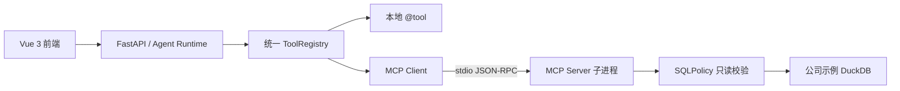

# DataPilot MCP 架构

## 组件关系



MCP Server 是独立 Python 进程，不共享 FastAPI 进程内存、数据库连接或密钥。DataPilot 后端通过标准输入输出和 MCP Client 通信。

## JSON-RPC 工具生命周期

### 1. 初始化

Client 启动 Server 子进程，双方交换能力和协议版本：

```json
{"jsonrpc":"2.0","id":1,"method":"initialize","params":{"protocolVersion":"2025-06-18","capabilities":{},"clientInfo":{"name":"datapilot","version":"0.1.0"}}}
```

### 2. 工具发现

Client 调用 `tools/list`，Server 返回工具名、描述和输入 JSON Schema：

```json
{"jsonrpc":"2.0","id":2,"method":"tools/list","params":{}}
```

DataPilot 将每个 MCP Tool 转换为 `RegisteredTool`：

- 工具名增加 `mcp__` 前缀，避免与本地工具冲突。
- `inputSchema` 直接作为参数校验规则。
- `parallel_safe` 默认为 `false`，因为外部工具是否只读不能仅凭协议判断。
- 调用时使用原始 MCP 工具名。

### 3. 工具调用

Agent 选择工具后，Client 发送 `tools/call`：

```json
{
  "jsonrpc": "2.0",
  "id": 3,
  "method": "tools/call",
  "params": {
    "name": "query_company_data",
    "arguments": {
      "sql": "SELECT department_id, SUM(salary) FROM employees GROUP BY department_id"
    }
  }
}
```

Server 执行以下步骤：

1. 接收工具名和参数。
2. 使用 SQLPolicy 校验单条 SELECT 和表名。
3. 在只读 DuckDB 示例数据中执行查询。
4. 将结构化结果放入 MCP `content` 或 `structuredContent`。

### 4. 结果转换与回填

Client 将 MCP 返回内容转换为普通 Python 数据：

- `structuredContent` 原样返回。
- 文本内容是合法 JSON 时解析为对象。
- 图片和其他内容转为带类型的结构。
- `isError=true` 转换为 `MCPToolCallError`。

转换后的结果进入 Agent 工具执行结果，并回填为 `tool` 消息。

### 5. 关闭

FastAPI 生命周期结束时，Client 关闭 `ClientSession` 和 stdio transport，MCP Server 子进程随之退出。

## 当前只读工具

`get_company_schema` 返回内置表的字段、类型和前 3 行样例。

`query_company_data` 查询内置示例表：

- `departments(id, name, location)`
- `employees(id, name, department_id, salary, hire_date)`

查询工具只接受一条 SELECT，不允许写操作、`information_schema`、
Schema 限定名称、外部文件、扩展加载或非白名单表。

推荐的固定调用顺序：

```text
mcp__get_company_schema
        ↓
根据合法字段生成 SQL
        ↓
mcp__query_company_data
```

如果 SQL 因越权表名或错误字段失败，Agent 必须根据错误更换参数，不能重复
提交完全相同的工具调用。

## 启动方式

本地以独立进程调试 MCP Server：

```powershell
Set-Location D:\ITstudy\DataPilot\backend
uv run python -m app.mcp.server
```

该命令通过 stdio 等待 MCP Client 发起 JSON-RPC 请求，不会显示普通 HTTP
端口。正常停止时使用 `Ctrl+C`。

Compose 环境由 FastAPI 启动时自动拉起同一命令。配置项为：

- `MCP_ENABLED=true`
- `MCP_SERVER_ARGS=["-m","app.mcp.server"]`
- `MCP_STARTUP_TIMEOUT_SECONDS=10`

`GET /api/health/ready` 会额外返回 `mcp: ok` 或 `mcp: error`。

## 失败策略

- MCP Server 启动失败不会阻止 DataPilot API 启动。
- 错误保存在 `app.state.mcp_error`，便于健康检查和排查。
- 单个 MCP 工具调用失败会转换为 Agent 可见的结构化错误。
- MCP 工具默认不允许并行执行，避免未知外部副作用。
