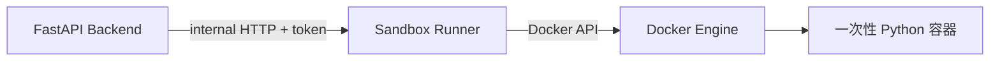

# DataPilot Sandbox

该镜像只用于执行模型生成的不可信 Python 分析代码，不得用于运行 FastAPI 或其他可信业务服务。

## 固定限制

- 每个任务使用独立临时容器。
- `--network=none`，禁止网络访问。
- 根文件系统只读。
- 临时工作目录按任务创建并挂载。
- 内存上限 512 MB。
- 进程数上限 64。
- CPU 上限 1 核。
- 执行超时 10 秒。
- stdout/stderr 截断到 8 KB。
- 删除全部 Linux capabilities，并启用 `no-new-privileges`。
- 不向容器传入数据库密码、模型密钥或业务环境变量。

具体限制由后端沙箱执行层在启动临时容器时强制执行。`docker-compose.yml` 中的 sandbox 服务用于构建和验证同一镜像，不作为共享代码执行池。

## 控制平面



FastAPI 后端不再挂载 `/var/run/docker.sock`。只有独立的 `sandbox-runner`
服务拥有 Docker Socket，并且只暴露固定接口：

- `/health/live`
- `/v1/execute/python`

请求不能指定镜像、挂载、网络、环境变量、CPU 或内存参数。Runner 根据自身配置
创建一次性容器。后端和 Runner 使用共享令牌验证内部请求，Runner 位于
`internal: true` 的独立网络，无法访问 PostgreSQL、Redis 或外网。

## 执行方式

每次 Python 执行都会：

1. 创建独立的一次性容器。
2. 挂载用户 `10001` 可写的独立 `/workspace` tmpfs。
3. 通过短期环境变量传入当前任务的代码和输入文件。
4. 使用 `/opt/sandbox/runner.py` 写入工作区并执行 `main.py`。
5. 在超时、结束或异常后删除容器，不保留共享执行状态。

该方式不依赖宿主机临时目录映射，因此同时适用于 Windows Docker Desktop 和 Linux。

Windows 本地开发前需要构建沙箱镜像：

```powershell
docker compose --profile sandbox build sandbox
```

后端通过已挂载的 Docker Socket 调用 Docker。Docker Desktop 未运行或镜像不存在时，执行器会返回明确错误，不会退回本机直接执行。

## SQL 执行

- DuckDB 只读取已经登记到分析引擎的 CSV/Parquet 表。
- PostgreSQL 执行器只在只读事务中运行 SQL，并设置语句超时。
- 允许访问的 PostgreSQL 表必须由后端可信配置提供，不能由模型或请求参数指定。
- 生产环境必须人工创建仅具备目标表 `SELECT` 权限的数据库账号；只读事务不能替代数据库账号的最小权限配置。
